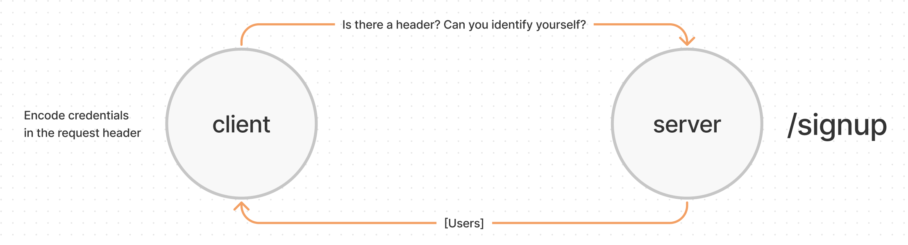

# Authentication

Created by Ryan Emmans

## Summary of Problem Domain

### **Phase 1 Requirements**

#### **As a user, I want to create a new account so that I may later login**

- Using a tool such as httpie, postman, or a web form:
  - Make a POST request to the/signup route with username and password
  - Your server should support both JSON and FORM data as input
  - On a successful account creation, return a 201 status with the user object in the body
  - On any error, trigger your error handler with an appropriate error

#### **As a user, I want to login to my account so that I may access protected information**

- Using a tool such as httpie, postman, or a web form:
  - Make a POST request to the /signin route
  - Send a basic authentication header with a properly encoded username and password combination
  - On a successful account login, return a 200 status with the user object in the body
  - On any error, trigger your error handler with the message “Invalid Login”

## Links to application deployment

- [Heroku Main Branch](https://ryanemmans-basic-auth.herokuapp.com/)
- [GitHub Actions](https://github.com/ryanemmans/basic-auth/actions)
- [Pull Requests](https://github.com/ryanemmans/basic-auth/pulls?q=is%3Apr+is%3Aclosed)

## UML

## Routes

- POST route for `/signup`
  - Accepts either a JSON object or FORM Data with the keys “username” and “password”.
  - Creates a new user record in a Postgres database.
  - Returns a 201 with the created user record.
- POST route for `/signin`
  - Use your basic authentication middleware to perform the actual login task.
  - `router.post('/signin', basicAuth, (req,res) => {});`
  - When validated, send a JSON object as the response with the following properties:
    - `user`: The users’ database record

## Notes
